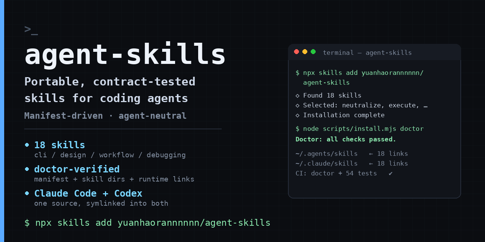

# agent-skills

**Portable skills for coding agents. Install once, run in Claude Code and Codex.**

English | [中文](README.zh-CN.md)

[](https://github.com/yuanhaorannnnnn/agent-skills/actions/workflows/ci.yml)
[](LICENSE)
[](package.json)
[](https://skills.sh/yuanhaorannnnnn/agent-skills)



Not a prompt dump. Every skill declares its trigger boundary, its gates and its artifacts, and the repository ships contract tests plus a `doctor` that fails when the manifest, the skill directories and the installed links disagree.

`manifest.yaml` is the source of truth for each skill's `enabled` flag, category, invocation mode, role and dependencies, and it maps one-to-one onto `skills/*/SKILL.md`. The installer symlinks the enabled set into the generic Agents directory and the Claude Code directory, so the source stays single.

## Why this is not another prompt collection

- **Declarative registry** — `manifest.yaml` records `enabled`, `category`, `invocation`, `role` and `calls` per skill; `doctor` validates the call graph, so an orchestrator can never call a user-invoked skill by accident.
- **Contract tests** — repository-level tests check skill directories, references, invocation boundaries and workflow state; CI runs `doctor` plus three test suites on every push and pull request.
- **Agent-neutral** — the installer only creates symlinks. It does not bind to one product and does not overwrite links owned by other sources.
- **Gates before actions** — high-risk workflows encode confirmation, verification and external state changes as explicit gates instead of running by default.

## Quick start

**Option 1 — the standard skills CLI** (no clone required)

```bash
npx skills add yuanhaorannnnnn/agent-skills                                   # install all
npx skills add yuanhaorannnnnn/agent-skills --list                            # preview first
npx skills add yuanhaorannnnnn/agent-skills -s neutralize -a codex            # one skill
```

**Option 2 — clone and install locally** (Node.js 18+)

```bash
git clone https://github.com/yuanhaorannnnnn/agent-skills.git ~/.agents/repos/agent-skills
cd ~/.agents/repos/agent-skills
npm ci
node scripts/install.mjs install
node scripts/install.mjs doctor
```

The installer links every enabled skill plus the shared `.scripts` directory:

```text
~/.agents/skills/
~/.claude/skills/
```

Updating later:

```bash
node scripts/install.mjs update    # git pull --ff-only, then reinstall
```

## The workflow it encodes

```text
INTAKE           STUDY            EXECUTE          VERIFY           SHIP
┌────────────┐   ┌────────────┐   ┌────────────┐   ┌────────────┐   ┌────────────┐
│passdown    │   │chart       │   │execute     │   │traceback   │   │sanitize    │
│handoff     │   │study hub   │   │run task    │   │align       │   │close out   │
└────────────┘   └────────────┘   └────────────┘   └────────────┘   └────────────┘

When something breaks: neutralize (root cause) → repair (bug ticket) → traceback (regression alignment)
When something is learned: codify (guardrail) → after-action (post-mortem)
```

Skills also fire from their own trigger boundaries: design docs route to `conops`, incident write-ups to `after-action`.

## Skill catalog

| Skill | Category | Invocation | Role | What it does |
|---|---|---|---|---|
| `acquisition` | media | user | adapter | Ingest videos, articles and PDFs into a knowledge base |
| `after-action` | workflow | model | renderer | Write a post-mortem for a hard fix |
| `breach` | design | model | renderer | Single-page HTML deliverables (status, flowcharts, digests) |
| `chart` | learning | user | orchestrator | Build a durable Study Hub for a repo or product |
| `codify` | workflow | model | discipline | Distill one reusable guardrail from a mistake |
| `conops` | workflow | model | renderer | Technical design document for review |
| `cover` | design | user | renderer | Generate a DESIGN.md token spec |
| `execute` | workflow | model | orchestrator | Run a task and leave a resumable record |
| `go-nogo` | meta | model | discipline | Decide whether a new skill or tool is worth building |
| `herdr` | automation | model | adapter | Inspect and drive Herdr panes |
| `neutralize` | debugging | model | discipline | Root-cause a defect, then scan for the same pattern nearby |
| `paperwork` | writing | model | discipline | Draft or rewrite technical documents around reader task and evidence |
| `passdown` | workflow | user | adapter | Hand off context from another agent session |
| `repair` | workflow | user | orchestrator | Four-stage bug-ticket workflow (Yunxiao) |
| `sanitize` | workflow | user | orchestrator | Close out a task with commits, or write a full technical report |
| `tasking` | workflow | user | orchestrator | Four-stage requirement workflow (Yunxiao) |
| `traceback` | review | model | discipline | Design → implementation → tests alignment gate |
| `x-likes-digest` | automation | user | adapter | Weekly digest of liked posts on X |

Adding, removing or disabling a skill means editing `manifest.yaml` first, then this table, then running the full verification.

## Verification

```bash
node scripts/install.mjs list       # list enabled skills by category
node scripts/install.mjs doctor     # check manifest, skill dirs and installed links

python3 -m unittest discover -s tests -p 'test_*.py'
python3 -m unittest discover -s skills/acquisition/tests -p 'test_*.py'
python3 -m unittest discover -s skills/passdown/tests -p 'test_*.py'
```

CI runs the same commands on every push and pull request; the badge above is the result, not a claim.

## Repository layout

```text
skills/<skill-name>/
├── SKILL.md            # skill definition and trigger boundary
├── references/         # reference contracts (optional)
├── scripts/            # gates and helper scripts (optional)
├── evals/              # trigger evals (optional)
└── templates/          # output templates (optional)
scripts/
├── install.mjs         # install, update, list, doctor
├── skill_telemetry.py  # privacy-safe local outcome events
└── ...
manifest.yaml           # skill registry
tests/                  # repository contract and install tests
```

## Contributing and security

Read [CONTRIBUTING.md](CONTRIBUTING.md) before changing a skill or workflow. Report security issues privately through [SECURITY.md](SECURITY.md) instead of opening a public issue.

## Maturity boundaries

The repository is iterating quickly and has no stable release; skill names, invocation contracts and install scope can change. There is no externally verified adoption or compatibility promise yet.

**Language:** the skill bodies are currently written in Chinese, because that is the language they were developed and used in. The `description` frontmatter and the catalog above are the reliable English entry point. A translated English pass over the skill bodies is planned, not shipped — treat this README as accurate about what exists today.

## License

[MIT](LICENSE)
