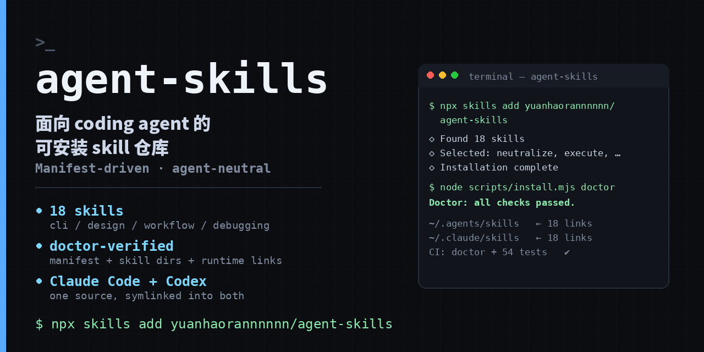

# agent-skills

**面向 coding agent 的可安装 skill 仓库：一次安装，Claude Code 与 Codex 同时可用。**

[English](README.md) | 中文

[](https://github.com/yuanhaorannnnnn/agent-skills/actions/workflows/ci.yml)
[](LICENSE)
[](package.json)
[](https://skills.sh/yuanhaorannnnnn/agent-skills)



`manifest.yaml` 是名称、启用状态、类别、调用方式和依赖关系的事实来源，与 `skills/*/SKILL.md` 目录一一对应。安装器把启用中的 skill 符号链接到通用 Agents 目录与 Claude Code 目录，源码只有一份。

> Not a prompt dump. Every skill declares its trigger boundary, its gates and its artifacts; the repository ships contract tests plus a `doctor` that fails when the manifest, the skill directories and the installed links disagree.

## 为什么不是一个提示词合集

- **声明式注册表**：`manifest.yaml` 记录每个 skill 的 `enabled`、`category`、`invocation`、`role` 和 `calls`，`doctor` 校验调用关系是否合法。
- **可验证契约**：仓库级测试检查 skill 目录、引用、调用边界与工作流状态；CI 在每次 push 与 PR 上执行 `doctor` 加三个测试套件。
- **agent 无关**：安装器只做符号链接，不绑定单一产品，也不覆盖其他来源的链接。
- **gate 优先**：高风险工作流把确认、验证、外部状态变更写成显式 gate，而不是默认自动执行。

## 快速开始

**方式一：标准 skills CLI**（推荐，无需 clone）

```bash
npx skills add yuanhaorannnnnn/agent-skills                                   # 安装全部
npx skills add yuanhaorannnnnn/agent-skills --list                            # 先看清单
npx skills add yuanhaorannnnnn/agent-skills -s neutralize -a codex            # 装单个
```

**方式二：clone 本地安装**（需要 Node.js 18+）

```bash
git clone https://github.com/yuanhaorannnnnn/agent-skills.git ~/.agents/repos/agent-skills
cd ~/.agents/repos/agent-skills
npm ci
node scripts/install.mjs install
node scripts/install.mjs doctor
```

安装会为所有启用中的 skill 和共享 `.scripts` 创建符号链接：

```text
~/.agents/skills/
~/.claude/skills/
```

后续更新：

```bash
node scripts/install.mjs update    # git pull --ff-only 后重新安装
```

## 工作流闭环

```text
理解             学习             执行             校验             收尾
┌────────────┐   ┌────────────┐   ┌────────────┐   ┌────────────┐   ┌────────────┐
│passdown    │   │chart       │   │execute     │   │traceback   │   │sanitize    │
│接手上下文  │   │学习调研    │   │委托执行    │   │交付对齐    │   │提交收尾    │
└────────────┘   └────────────┘   └────────────┘   └────────────┘   └────────────┘

出问题：neutralize 定位根因 → repair 缺陷闭环 → traceback 回归对齐
有收获：codify 沉淀 guardrail → after-action 故障复盘
```

skill 按自身边界自动触发：写设计文档走 `conops`，缺陷单走 `repair`，出事故走 `after-action`。

## Skill 目录

| Skill | Category | Invocation | Role | 做什么 |
|---|---|---|---|---|
| `acquisition` | media | user | adapter | 视频/文章/PDF 摄入知识库 |
| `after-action` | workflow | model | renderer | 故障复盘记录 |
| `breach` | design | model | renderer | 单页 HTML 交付页 |
| `chart` | learning | user | orchestrator | 软件/仓库 Study Hub |
| `codify` | workflow | model | discipline | 沉淀可复用 guardrail |
| `conops` | workflow | model | renderer | 技术开发设计方案 |
| `cover` | design | user | renderer | 设计规范（DESIGN.md） |
| `execute` | workflow | model | orchestrator | 执行任务并留可恢复记录 |
| `go-nogo` | meta | model | discipline | 判断该不该做、该不该建 skill |
| `herdr` | automation | model | adapter | 控制 Herdr pane |
| `neutralize` | debugging | model | discipline | 根因定位与邻近扫描 |
| `paperwork` | writing | model | discipline | 技术文档起草与重写 |
| `passdown` | workflow | user | adapter | 跨 agent 会话交接 |
| `repair` | workflow | user | orchestrator | 云效缺陷单全流程修复 |
| `sanitize` | workflow | user | orchestrator | 收尾提交 / 完整技术报告 |
| `tasking` | workflow | user | orchestrator | 需求开发四阶段指挥 |
| `traceback` | review | model | discipline | 设计-实现-测试三方对齐 |
| `x-likes-digest` | automation | user | adapter | X 点赞周报 |

新增、移除或禁用 skill 时，先更新 `manifest.yaml`，再同步本表，并运行完整验证。

## 验证

```bash
node scripts/install.mjs list       # 按类别列出已启用 skill
node scripts/install.mjs doctor     # 检查 manifest、skill 文件和已安装链接

python3 -m unittest discover -s tests -p 'test_*.py'
python3 -m unittest discover -s skills/acquisition/tests -p 'test_*.py'
python3 -m unittest discover -s skills/passdown/tests -p 'test_*.py'
```

CI 在每次 push 与 PR 上执行同一组命令，徽章状态就是真实结果。

## 目录结构

```text
skills/<skill-name>/
├── SKILL.md            # skill 定义与触发边界
├── references/         # 参考契约（可选）
├── scripts/            # gate 或辅助脚本（可选）
├── evals/              # 触发评测（可选）
└── templates/          # 输出模板（可选）
scripts/
├── install.mjs         # 安装、更新、列出与 doctor
├── skill_telemetry.py  # 隐私安全的本地结果事件
└── ...
manifest.yaml           # skill 注册表
tests/                  # 仓库级契约与安装测试
```

## 贡献与安全

提交 skill 或工作流修改前，请阅读 [CONTRIBUTING.md](CONTRIBUTING.md)。安全问题请按 [SECURITY.md](SECURITY.md) 私下报告，不要先开公开 issue。

## 成熟度边界

该仓库仍在快速迭代，尚未发布稳定 release；skill 名称、调用契约和安装范围可能变化，当前没有可核验的外部采用量或兼容性承诺。仓库内容以中文为主，英文使用者可先读各 `SKILL.md` 的 `description` 字段判断触发边界。

## License

[MIT](LICENSE)
