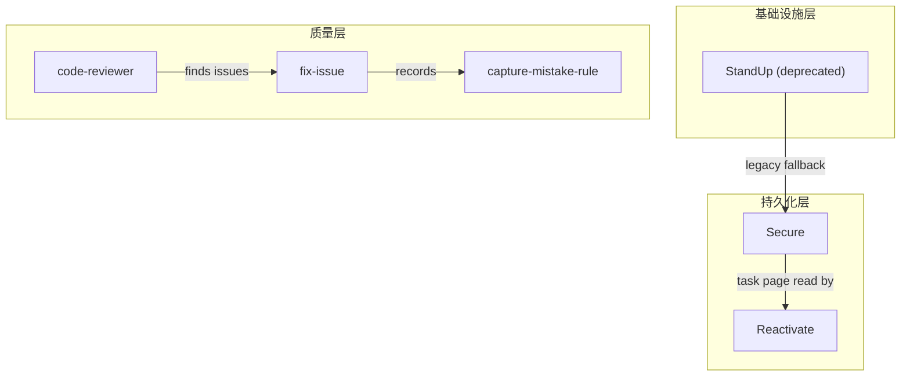

# Mode: Architecture (-a)

Architecture mold visualizes the layered structure and functional clustering of skills. Use `flowchart TD` with `subgraph` for layers. Infrastructure at bottom, orchestration in middle, user-facing at top.

## Steps

1. Read `references/infer_relations.md` prompt template.
2. Collect skill data via `scripts/scan_skills.py`.
3. Perform relationship inference with LLM, specifying mold type `architecture`.
4. Check cohesion. If `none` or `weak`, follow downgrade rules from SKILL.md.
5. Generate Mermaid source from the JSON topology:
   - Start with `flowchart TD`
   - Create `subgraph` for each group from LLM output
   - Place subgraphs in dependency order (bottom = infrastructure, top = user-facing)
   - Declare nodes within subgraphs
   - Draw cross-layer edges between subgraphs
   - Draw intra-layer edges within subgraphs
6. Render based on format flag:
   - PNG: mmdc
   - HTML: mermaid.js template
   - ASCII: render_ascii.py --mold architecture

## Mermaid Style Conventions

- Subgraph title: short functional layer name
- Node shape: rectangle `A["Name"]` within subgraphs
- Cross-layer edges: solid arrows between subgraphs
- Intra-layer edges: dashed arrows within subgraphs
- Layer ordering: bottom-to-top = infrastructure → middleware → application

## Example

