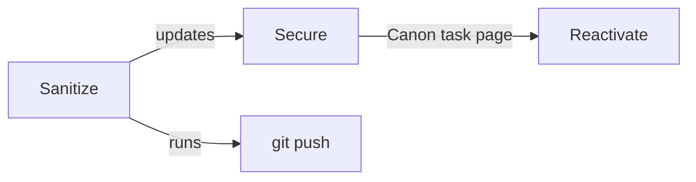

# Mode: Workflow (-w)

Workflow mold visualizes the execution order and information flow between skills. Use `flowchart LR` (left-to-right) for linear sequences, `flowchart TD` (top-down) for hierarchical branching.

## Steps

1. Read `references/infer_relations.md` prompt template.
2. Collect skill data via `scripts/scan_skills.py`.
3. Perform relationship inference with LLM, specifying mold type `workflow`.
4. Check cohesion. If `none` or `weak`, follow downgrade rules from SKILL.md.
5. Generate Mermaid source from the JSON topology:
   - Start with `flowchart LR` or `flowchart TD`
   - Declare each node: `A["Skill Name"]`
   - Draw edges: `A -->|label| B`
   - For branching: `A --> B` and `A --> C`
   - For convergence: `B --> D` and `C --> D`
6. Render based on format flag:
   - PNG: mmdc
   - HTML: mermaid.js template
   - ASCII: render_ascii.py --mold workflow

## Mermaid Style Conventions

- Node shape: rounded rectangle `A["Name"]`
- Edge style: solid arrow `-->`
- Edge label: `-->|label|`
- Branching: keep main path horizontal, branches vertical
- Color coding (Mermaid classDef):
  ```mermaid
  classDef trigger fill:#ffcc99,stroke:#ff9933
  classDef data fill:#99ccff,stroke:#3399ff
  classDef depends fill:#e0e0e0,stroke:#999999
  classDef extends fill:#99ff99,stroke:#33cc33
  classDef includes fill:#cc99ff,stroke:#9933cc
  ```

## Example


