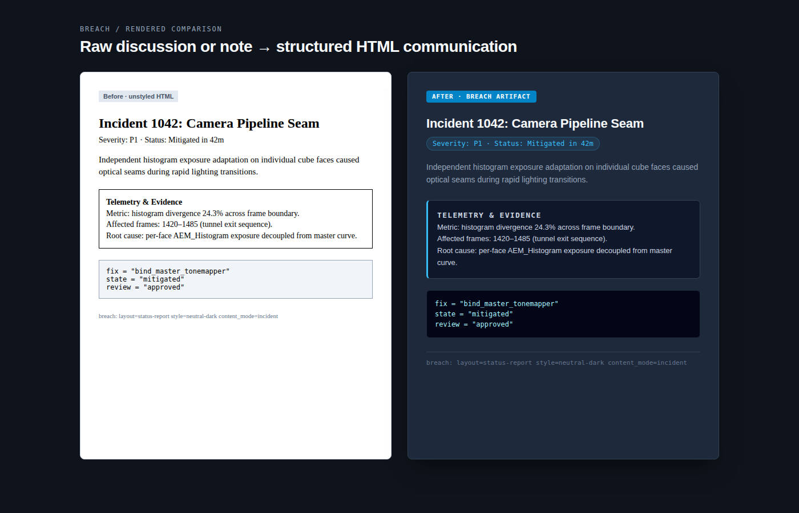

# Breach: fast HTML pages for development communication

`breach` turns supplied content into a single-page HTML artifact. Use it for a
status page, PR write-up, incident page, flowchart, HTML slide-like page, or a
structured digest of a multi-party discussion.

`SKILL.md` is the agent-facing execution contract. This README is a short guide
to choosing the route and checking the resulting artifact.

## Choose the route

### General page

Choose this route when the requested output is a page, report, flowchart, or
slide-like HTML artifact.

```text
approved content + evidence
            ↓
page type from html-effectiveness
            ↓
project DESIGN.md tokens (or selected reference DESIGN.md)
            ↓
HTML page + provenance comment + visible footer
```

The layout source determines spatial structure. The style source determines
colors, typography, spacing, radius, shadows, and component tone. They are
separate inputs. If a project `DESIGN.md` exists, it takes precedence; never
invent a style source or write a new `DESIGN.md` as part of page generation.

When the selected style defines `content-modes`, record the chosen mode in
`BREACH_PROVENANCE` as `content_mode`. A content mode changes treatment inside
this artifact; it does not change the renderer or authorize rewriting supplied
prose. `eli5` is an optional General-page profile for an explicit beginner
request. Keep qualifiers, uncertainty, and evidence intact.

Every General page carries exact source paths in an HTML comment and a concise
visible footer. Absolute paths belong in the comment, not in the visible UI.

### Discussion digest

Choose this route for an email thread, GitHub issue or PR, chat log, forum
discussion, or similar request to explain who argued what, how positions
changed, what was decided, and what remains open.

```text
source discussion
       ↓
schema-compliant JSON intermediate
       ↓
raw/discussions/<slug>.json
       ↓
deterministic renderer + bundled template
       ↓
queries/<slug>.html
```

The JSON must preserve participant names, stances, timeline, decisions, open
questions, and actions. Keep the timeline to 30 entries or fewer, mark at most
8 key events, include at least one decision record, and keep `unresolved`
non-empty. The renderer owns the HTML structure and adds its template
provenance; do not select a generic layout or style for this route.

See [`discussion-digest-schema.md`](references/discussion-digest-schema.md) for
the intermediate contract and [`render_discussion.py`](scripts/render_discussion.py)
for the deterministic command-line renderer.

## Content and evidence boundary

The caller or an upstream workflow owns source acquisition, factual analysis,
and evidence quality. `breach` owns HTML structure, visual integration, and
provenance. It must not turn an inference into a fact, strengthen an approved
conclusion, or claim that static rendering proves runtime behavior.

For technical narrative, use the content-writing workflow before rendering.
For charts, include one only when real quantitative data or an honest
relationship graph supports an independent conclusion; do not invent scores,
weights, benchmarks, or decorative KPIs. A chart, when used, keeps both its
own template/license provenance and Breach page provenance.

## Non-goals

`breach` does not create native Word documents, presentation decks,
spreadsheets, or full product visual designs. Use the requested native artifact
workflow for those outputs. It also does not copy HTML into Canon; a caller may
record the artifact path and promote durable decisions separately.

## Local references

- [`SKILL.md`](SKILL.md): complete trigger, routing, provenance, and output contract.
- [`discussion-digest.html`](assets/discussion-digest.html): bundled digest template.
- [`discussion-digest-schema.md`](references/discussion-digest-schema.md): JSON schema and limits.
- [`render_discussion.py`](scripts/render_discussion.py): JSON-to-HTML renderer.

## Rendered comparison

The same development communication content (an incident report with telemetry,
root cause, and fix) is shown before and after Breach formatting is applied.
The comparison is a local, reproducible HTML render:



Inspect the [HTML source](examples/before-after.html) to reproduce the PNG.
