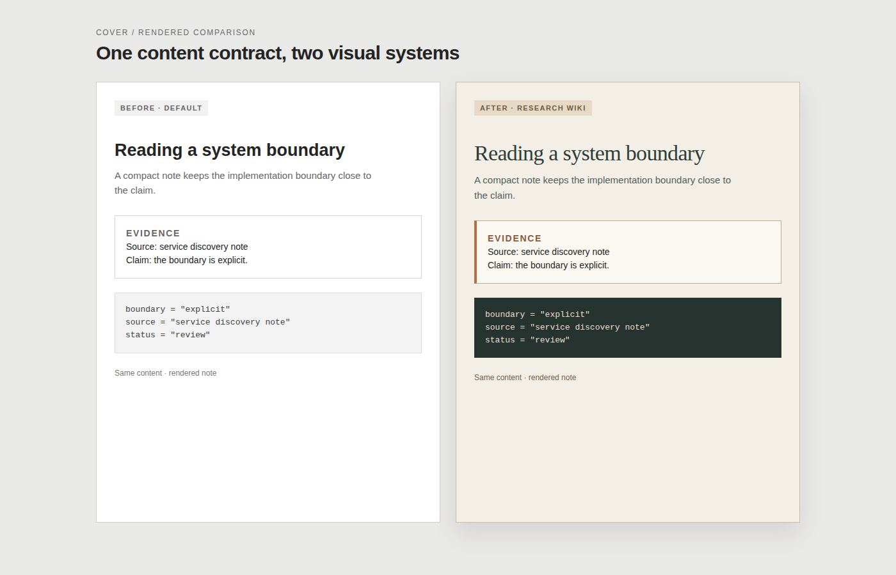

# Cover: turn visual intent into a usable design system

`cover` creates a project-owned `DESIGN.md`: a compact specification that
subsequent UI and HTML work can consume consistently. It is for the moment
before implementation, when a project has a product, an audience, and a visual
direction, but not yet a coherent token system.

`SKILL.md` remains the execution contract. This README is a human-facing tour
of the result, its inputs, and the boundary around it.

## What it produces

```text
product intent + audience + constraints
                 ↓
reference vocabulary (2–4 DESIGN.md files)
                 ↓
project-specific visual thesis
                 ↓
DESIGN.md + .design/evidence.json
                 ↓
HTML/UI work consumes tokens and component rules
```

The output is not a CSS framework, a component library, or an imitation of a
reference product. It is a stable visual contract: palette roles, typography,
spacing, component treatment, and any project-specific guardrails.

## A typical request

> 为一个面向工程师的研究 Wiki 做设计规范：阅读密度高，但章节开场希望有温暖、观察式的编辑感；数据表、代码和证据必须保持清晰。

`cover` first distinguishes the durable constraints from the style request:

| Input | Design consequence |
|---|---|
| Technical research reader | Analytical body text, legible tables and code |
| Warm editorial opening | A restrained display voice and a limited pigment family |
| Evidence must remain clear | Decoration never carries claims; status colors keep their semantics |
| Existing project assets | Existing brand constraints override reference preferences |

It then studies two to four relevant reference specifications, adapts their
vocabulary to this project, and records the sources in `.design/evidence.json`.
The evidence file makes the synthesis inspectable and explicitly flags
wholesale copying as invalid.

## Illustrative output shape

This is a shortened shape, not a reusable default palette:

```yaml
---
version: alpha
name: Research Wiki
description: Dense analytical reading with a warm, restrained editorial entry.
---

colors:
  primary: "#..."
  ink: "#..."
  canvas: "#..."
  surface-card: "#..."
  success: "#..."
  warning: "#..."
  error: "#..."

typography:
  display-lg: { fontFamily: "...", fontSize: 48px }
  body-md: { fontFamily: "...", fontSize: 16px }
  code: { fontFamily: "...", fontSize: 14px }

spacing:
  unit: 4px
  section: 72px

components:
  evidence-card:
    rule: "Keep the source and measurement close to the claim."
```

A useful `DESIGN.md` contains enough direction to make later artifacts agree,
but not prescriptive HTML, CSS, or JSX. It has one visual thesis rather than a
bag of disconnected fashionable tokens.

## How it connects to the visual workflow

`cover` establishes the style layer. A rendering skill can then select a page
layout independently while consuming this project's tokens. For an
evidence-heavy page, the same system can allow an editorial header while
keeping charts, tables, code, screenshots, and status signals analytical.

```text
cover                  renderer / implementation              review
DESIGN.md       →      layout + content + project tokens  →    technical and visual gates
visual thesis          provenance and responsive artifact       adoption decision
```

This separation is deliberate: a page can be technically correct yet visually
unconvincing, and visually attractive yet unsuitable for evidence. Both need
their own review.

## Verification and boundaries

Every generated design specification is accompanied by
`.design/evidence.json`. Run:

```bash
python3 skills/cover/scripts/synthesis_gate.py \
  --design /absolute/path/to/DESIGN.md \
  --evidence /absolute/path/to/.design/evidence.json
```

The gate requires a nontrivial `DESIGN.md`, at least two references, no more
than four references, and no wholesale-copy flag.

Use `cover` when visual direction needs to become a reusable project contract.
Do not use it for a one-off color tweak, for copying a branded interface, or
as a substitute for accessibility, responsive testing, or a visual review of
the rendered result.

## Related artifacts

- [`SKILL.md`](SKILL.md): agent-facing trigger, synthesis and gate contract.
- [`implementation-anti-slop.md`](references/implementation-anti-slop.md):
  implementation guidance; read only when building or reviewing UI from a
  generated specification.
- [`synthesis_gate.py`](scripts/synthesis_gate.py): deterministic output gate.

## Rendered comparison

The same research-Wiki content is shown before and after the design system is
applied. The comparison is a local, reproducible HTML render:



Inspect the [HTML source](examples/before-after.html) to reproduce the PNG.
